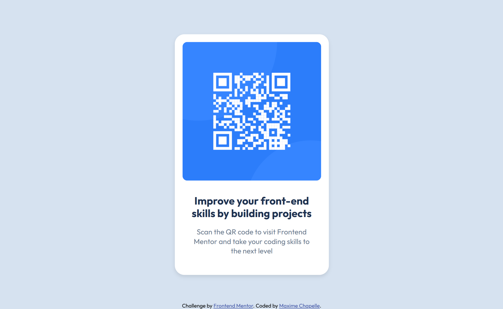

# Frontend Mentor - QR code component solution

This is a solution to the [QR code component challenge on Frontend Mentor](https://www.frontendmentor.io/challenges/qr-code-component-iux_sIO_H).

---

##  Overview

This project is a simple QR code component built to match a provided design as closely as possible.

The objective was to practice fundamental HTML and CSS skills, focusing on layout, spacing, and visual accuracy.

---

##  Screenshot



---

##  Links

* Solution URL: https://github.com/maxi1993-tech/qr-code-component
* Live Site URL: https://maxi1993-tech.github.io/qr-code-component/

---

##  My process

###  Built with

* HTML5
* CSS3
* Flexbox
* CSS variables

---

###  What I learned

This is my first Frontend Mentor challenge. I have been learning HTML and CSS since February 2026.

I learned how to center an element both vertically and horizontally using Flexbox:

```css
body {
    display: flex;
    justify-content: center;
    align-items: center;
    min-height: 100vh;
}
```

This approach is simple and reliable for small layouts because it avoids positioning hacks and keeps the layout flexible.

I also learned how to use CSS variables to organize and reuse colors:

```css
:root {
    --color-bg: hsl(212, 45%, 89%);
    --color-card: hsl(0, 0%, 100%);
}
```

This improves maintainability and makes future changes easier.

I also used `box-sizing: border-box` so that padding is included in the total width of an element, not added on top of it.

---

### Challenges

The main challenge was matching the design spacing and proportions closely.

Small changes in padding, font size, and element width had a significant visual impact, which required careful iteration and comparison with the original design.

---

###  Continued development

* Continue practicing Flexbox
* Learn CSS Grid
* Improve responsive design with media queries
* Next time, I'll use `.card p` instead of just `p` to keep styles scoped to their component.

---

###  AI Collaboration

* Tool used: Claude (Anthropic)

Claude guided me through the project by asking questions instead of providing direct solutions.
I remained responsible for writing the code and making decisions, which helped reinforce my understanding of CSS concepts.

---

##  Author

* Frontend Mentor - https://www.frontendmentor.io/profile/maxi1993-tech
* GitHub - https://github.com/maxi1993-tech