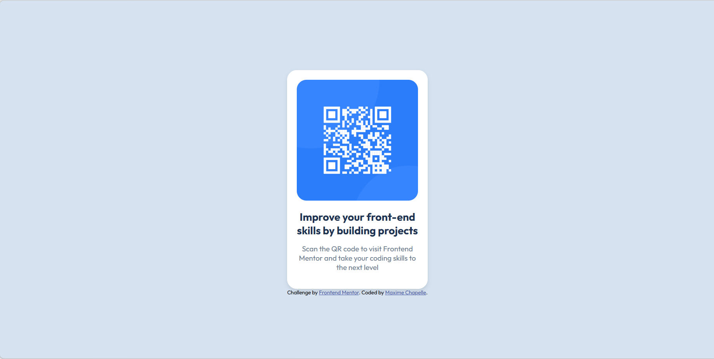

# Frontend Mentor - QR code component solution

This is a solution to the [QR code component challenge on Frontend Mentor](https://www.frontendmentor.io/challenges/qr-code-component-iux_sIO_H).

## Table of contents

- [Overview](#overview)
  - [Screenshot](#screenshot)
  - [Links](#links)
- [My process](#my-process)
  - [Built with](#built-with)
  - [What I learned](#what-i-learned)
  - [Continued development](#continued-development)
  - [AI Collaboration](#ai-collaboration)
- [Author](#author)

## Overview

### Screenshot



### Links

- Solution URL: [Add solution URL here](https://your-solution-url.com)
- Live Site URL: [Add live site URL here](https://your-live-site-url.com)

## My process

### Built with

- Semantic HTML5 markup
- CSS custom properties (variables)
- Flexbox
- Desktop-first workflow

### What I learned

This is my first Frontend Mentor challenge. I have been learning HTML and CSS since February 2026.

I learned how to center an element on the page using Flexbox on the body:

```css
body {
    display: flex;
    justify-content: center;
    align-items: center;
    min-height: 100vh;
}
```

I also learned how to use CSS variables with `:root` to organize colors:

```css
:root {
    --color-bg: hsl(212, 45%, 89%);
    --color-card: hsl(0, 0%, 100%);
}
```

### Continued development

- Keep practicing Flexbox
- Learn CSS Grid
- Improve my skills with media queries

### AI Collaboration

- Tool used: Claude (Anthropic)
- Claude guided me step by step without giving direct solutions — asking questions to help me think through each problem myself.
- This approach helped me understand the "why" behind each CSS property, not just the "what".

## Author

- Frontend Mentor - [@maxi1993-tech](https://www.frontendmentor.io/profile/maxi1993-tech)